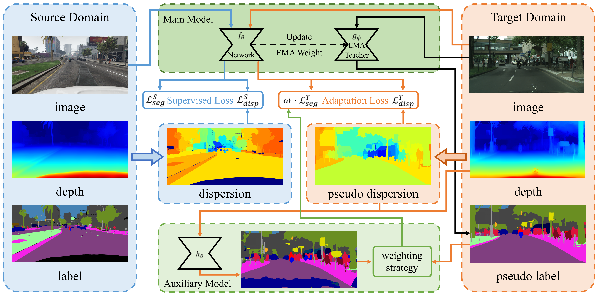
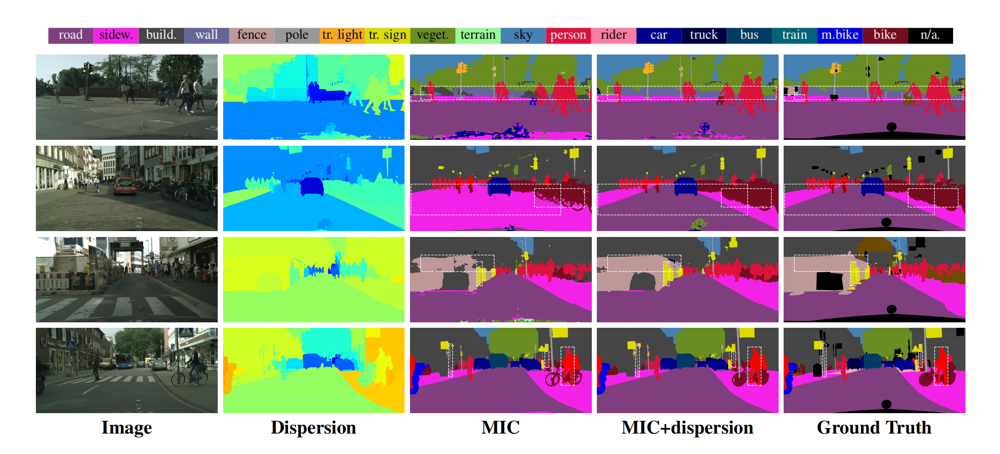
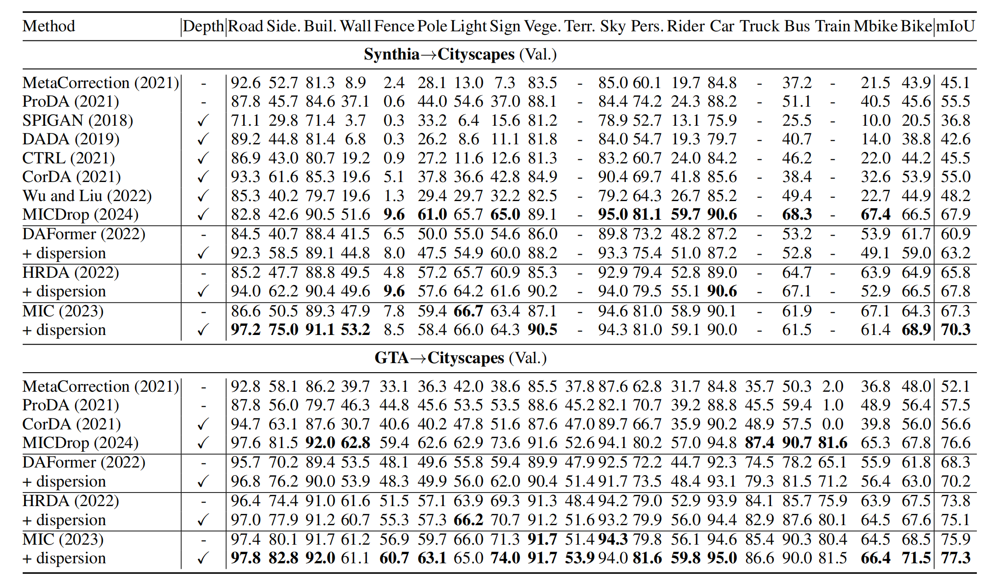

# Unsupervised Domain Adaptation for Semantic Segmentation Based on Instance Directional Dispersion

# Overview

Unsupervised domain adaptation (UDA) for semantic segmentation aims to transfer knowledge from synthetic datasets to real-world domains. Existing methods bridge the domain gap through innovative architectures and adaptation strategies, with **geometric cues** like **image depth** commonly used to mitigate domain discrepancies. While depth information has proven effective in enhancing segmentation performance, current methods often treat depth as the primary geometric feature, overlooking **domain-invariant spatial patterns** of **semantic instances**. Additionally, **self-training with pseudo-labels** is widely used, but existing weighting methods rely primarily on prediction confidence, neglecting the role of **semantic instance geometry** in evaluating pseudo-label reliability.


**Directional dispersio**n quantifies the **spatial distribution** of supporting class instances relative to a given target instance by capturing the directional arrangement of these supporting instances around the target. For instance, when person instances are uniformly distributed around a target car instance, the supporting directions show **high variance**, resulting in a **higher dispersion value**. Conversely, when person instances are primarily aligned in similar directions relative to a target sky instance, the supporting directions are **more concentrated**, yielding a **lower dispersion value**. The spatial distribution patterns of semantic segmentation instances typically exhibit **consistent structures** across both source and target domains.



To address these challenges, we propose a novel **metric** in the **joint image-depth space** to quantify the **directional dispersion** between semantic class instances, leveraging it as **an alternative to traditional depth information**. This metric is integrated as an auxiliary task within a multi-task learning framework to improve cross-domain semantic segmentation performance, offering a more clear and robust representation for domain adaptation. Furthermore, by concatenating the **dispersion-based features** with depth information to form a **dual-modality geometric representation**, we pre-train an auxiliary semantic segmentation network. This network works in tandem with the main network, while a geometry-guided, pixel-wise pseudo-label **weight adjustment strategy** is applied during self-training to enhance both stability and accuracy.

Experimental results on state-of-the-art methods **DAFormer**, **HRDA**, and **MIC** show that our approach leads to performance **improvements** of **2.3%**, **2.0%**, and **3.0%** on Synthia→Cityscapes, and **1.9%**, **1.3%**, and **1.4%** on GTA→Cityscapes, respectively.

The following **visual comparison** showcases our results versus the baseline MIC on two benchmarks: Synthia→Cityscapes (top two rows) and GTA→Cityscapes (bottom two rows).



## Comparison with State-of-the-Art UDA

Our approach achieves **clear improvements** over existing UDA techniques on both GTA→Cityscapes and Synthia→Cityscapes benchmarks. The following figure illustrates these performance gains.



## Setup Environment

Requirements

```plaintext
Python ≥ 3.8.5
CUDA ≥ 11.0.3
mmcv-full == 1.3.7
All other dependencies listed in requirements.txt
```

Quick Start

```shell
# 1. Create and activate a virtual environment
#    Alternatively, you can use python's venv to create a virtual environment.
conda create -n dispersion python=3.8.5
conda activate dispersion

# 2. Install core dependencies
pip install -r requirements.txt -f https://download.pytorch.org/whl/torch_stable.html

# 3. Install mmcv-full (after PyTorch and other requirements)
pip install mmcv-full==1.3.7
```

Pretrained Models

1. Download the MiT-B5 ImageNet weights from the [SegFormer](https://github.com/NVlabs/SegFormer?tab=readme-ov-file#training) ([OneDrive link](https://connecthkuhk-my.sharepoint.com/:f:/g/personal/xieenze_connect_hku_hk/EvOn3l1WyM5JpnMQFSEO5b8B7vrHw9kDaJGII-3N9KNhrg?e=cpydzZ)).
2. Download the GTA and Synthia auxiliary model weights from the [Google Drive](https://drive.google.com/drive/folders/1OBCDOTHOpo66GGfHfIqfoBBeWrYM2Lwe?usp=sharing).
3. Place all the `.pth` files under the `pretrained/` directory.

```plaintext
Dispersion
├── ...
├── pretrained
│   ├── mit_b5.pth
│   ├── gta_auxiliary.pth
│   └── synthia_auxiliary.pth
├── ...
```

SO File Libraries

1. Fetch libdispersion_extractor.so and libdispersion_extractor_hr.so from the designated [Google Drive](https://drive.google.com/drive/folders/1vcqITC16Yyh7gCYR39KXZaxCh5wn7Btf?usp=sharing).
2. Place the `.so` files under the `dispersion_extractor/so_file_lib/` directory.

```plaintext
Dispersion
├── ...
├── dispersion_extractor
│   └── so_file_lib
│       ├── libdispersion_extractor.so
│       └── libdispersion_extractor_hr.so
├── ...
```

## Dataset Setup

1. **Cityscapes**

   - Download **leftImg8bit_trainvaltest.zip** and **gt_trainvaltest.zip** from [Cityscapes Downloads](https://www.cityscapes-dataset.com/downloads/).
   - Extract both archives into `data/cityscapes/`.

2. **GTA**

   - Download the image and label packages from [TU-Darmstadt GTA Download](https://download.visinf.tu-darmstadt.de/data/from_games/).
   - Extract the contents into `data/gta/`.

3. **Synthia (Optional)**

   - Download **SYNTHIA-RAND-CITYSCAPES** from [SYNTHIA Downloads](http://synthia-dataset.net/downloads/).
   - Extract them into `data/synthia/`.

4. **Depth Images**

   - Download depth maps generated by Depth Anything v2 from [Google Drive](https://drive.google.com/drive/folders/1tfp__2_Vzem84e7B2f2WXU886XbRQaIa?usp=sharing).
   - Place each dataset’s depth files under `data/<dataset>/depth/` (e.g. `data/cityscapes/depth/`).

**Final directory structure:**

```
Dispersion
├── ...
├── data
│   ├── cityscapes
│   │   ├── leftImg8bit
│   │   │   ├── train
│   │   │   └── val
│   │   ├── gtFine
│   │   │   ├── train
│   │   │   └── val
│   │   └── depth
│   │       ├── train
│   │       └── val
│   ├── synthia
│   │   ├── RGB
│   │   ├── GT
│   │   │  └── LABELS
│   │   └── depth
│   ├── gta
│   │   ├── images
│   │   ├── labels
│   │   └── depth
├── ...
```

**Convert dataset labels and generate class indices for RCS with:**

```shell
python tools/convert_datasets/gta.py data/gta --nproc 8
python tools/convert_datasets/cityscapes.py data/cityscapes --nproc 8
python tools/convert_datasets/synthia.py data/synthia/ --nproc 8
```

## Training

Annotated dispersion configs for DAFormer, HRDA, and MIC on both GTA→Cityscapes and Synthia→Cityscapes are available under [`configs/dispersion`](configs/dispersion).
For example, to train Dispersion(MIC) on GTA→Cityscapes:

```shell
python run_experiments.py --config configs/dispersion/gtaHR2csHR_mic_dispersion.py
```

- Logs & checkpoints will be saved in `work_dirs/`.
- Generated configs for all other experiments can be found in `configs/generated/`.

## Evaluation

To evaluate a trained model, run:

The `run_name` directory should correspond to the specific experiment's name, and the configuration file should be named based on the `run_name` (e.g., if `run_name` is `work_dirs/run_name/`, the config file should be named `run_name.py`; for older configurations, it should be named `run_name.json`).

```shell
/bin/bash test.sh work_dirs/run_name/
```

- Predictions will be saved in `work_dirs/<run_name>/preds/`
- The model’s **mIoU** is printed to the console.

**Synthia→Cityscapes mIoU**
The default evaluation computes mIoU over all 19 Cityscapes classes, but Synthia only provides labels for 16 of them. To report mIoU on the overlapping classes:

```plaintext
mIoU16 = mIoU19 × ( 19 / 16 )
```

where `mIoU19` is the value printed by the evaluation script.

## Checkpoints

Below are the checkpoints of our method for each benchmark:

- [Dispersion(MIC) for GTA→Cityscapes](https://drive.google.com/file/d/1YAijoSbWJ9F3rAdUE2eHxjQQMfVm675r/view?usp=sharing)
- [Dispersion(HRDA) for GTA→Cityscapes](https://drive.google.com/file/d/1tq8QEfR4LbT6_MB0gfGou3N6Z6cj6vvF/view?usp=sharing)
- [Dispersion(DAFormer) for GTA→Cityscapes](https://drive.google.com/file/d/1GwYVEdk-0AzJuGkIobvJzC5G7f2USnU8/view?usp=sharing)
- [Dispersion(MIC) for Synthia→Cityscapes](https://drive.google.com/file/d/1UGeTsKzE6IvUdhBgdWV93SQ3_gOcxnJ1/view?usp=sharing)
- [Dispersion(HRDA) for Synthia→Cityscapes](https://drive.google.com/file/d/1ve7_1lMqiO4O3fsVnvJ2RTO7If39OPau/view?usp=sharing)
- [Dispersion(DAFormer) for Synthia→Cityscapes](https://drive.google.com/file/d/1KEsnEHSM5pM5ejDf067vwHjtiGRD20WW/view?usp=sharing)

## Acknowledgements

This project builds on the following open-source projects; we gratefully thank their authors for making their code publicly available.

- [MMSegmentation](https://github.com/open-mmlab/mmsegmentation)
- [SegFormer](https://github.com/NVlabs/SegFormer)
- [DACS](https://github.com/vikolss/DACS)
- [DAFormer](https://github.com/lhoyer/DAFormer)
- [HRDA](https://github.com/lhoyer/HRDA)
- [MIC](https://github.com/lhoyer/MIC)
